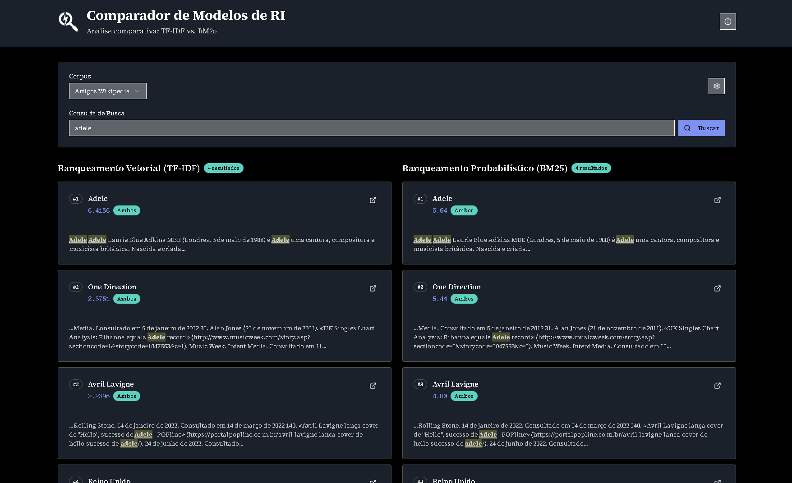
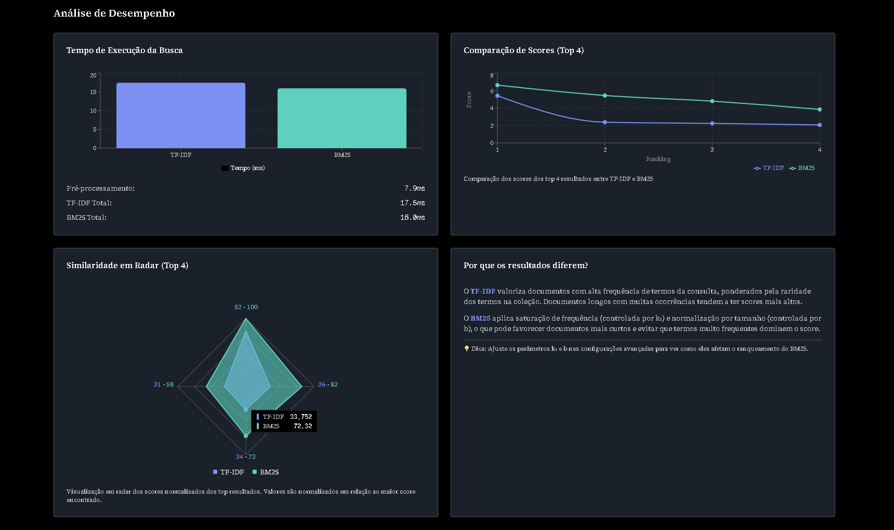

# 🔍 Comparador de Modelos de RI

Uma aplicação web moderna e interativa para comparar modelos de Recuperação de Informação (RI), demonstrando as diferenças entre **TF-IDF** (Modelo Vetorial) e **BM25** (Modelo Probabilístico) em tempo real.

  
  
<em>Interface principal com busca comparativa entre TF-IDF e BM25</em>

  
  
<em>Dashboard de métricas e análise comparativa de performance</em>

---

## 🎯 O que é este projeto?

Este projeto é uma ferramenta educacional/científica e de demonstração que permite visualizar e comparar dois dos modelos de busca mais populares da área de Recuperação de Informação (RI):

- **TF-IDF (Term Frequency-Inverse Document Frequency)**: Modelo vetorial que representa documentos como vetores no espaço multidimensional
- **BM25 (Best Matching 25)**: Modelo probabilístico que estima a relevância baseado em probabilidades

A aplicação processa um corpus de **97 artigos da Wikipedia em português** e permite realizar buscas comparando os resultados de ambos os modelos lado a lado.

---

## ✨ Funcionalidades

### 🔎 Busca Comparativa
- **Busca em tempo real** com dois modelos simultaneamente
- **Visualização lado a lado** dos resultados de TF-IDF e BM25
- **Destaque automático** dos termos pesquisados nos snippets
- **Scores detalhados** para cada documento encontrado
- **Badge "Ambos"** indicando documentos presentes nos dois ranqueamentos

### 📊 Análise de Performance
- **Métricas de tempo** de execução de cada modelo
- **Gráficos comparativos** de scores dos top resultados
- **Visualização em radar** da similaridade entre modelos
- **Explicações contextuais** sobre as diferenças entre os modelos

### 🎨 Interface Moderna
- **Design responsivo** e intuitivo
- **Tema dark** para melhor experiência visual
- **Paginação inteligente** dos resultados
- **Links diretos** para os PDFs originais no GitHub

### ⚙️ Configuração Avançada
- **Ajuste de parâmetros BM25**:
  - `k1`: Controla saturação de frequência (0.5 - 2.0)
  - `b`: Controla normalização por tamanho (0.0 - 1.0)
- **Diferentes pesos para TF-IDF**: log, raw, binary
- **Filtros de resultados** configuráveis

---

## 🚀 Como Usar

### Exemplo de Uso

1. **Digite uma busca** (ex: "adele", "brasil", "futebol")
2. **Compare os resultados** entre TF-IDF e BM25 lado a lado
3. **Analise as métricas** de performance no dashboard
4. **Ajuste os parâmetros** (k1, b) e veja como afetam o ranqueamento
5. **Explore os PDFs** clicando nos links externos

A aplicação já vem com uma busca automática por "adele" ao carregar, permitindo que você veja os resultados imediatamente!

---

## 📚 Corpus de Documentos

O sistema utiliza um corpus de **97 artigos populares da Wikipedia em português**, incluindo temas como:
- Personalidades (Adele, Albert Einstein, Cristiano Ronaldo)
- Países e cidades (Brasil, Estados Unidos, São Paulo)
- Tecnologia (Google, Facebook, Internet)
- História (Revolução Francesa, Segunda Guerra Mundial)
- Entre outros

Todos os PDFs estão disponíveis no repositório: [wiki-popular-articles-to-pdf](https://github.com/dev-jonathan/wiki-popular-articles-to-pdf)

---

## 🛠️ Tecnologias Utilizadas

### Frontend
- **Next.js 14** - Framework React com App Router
- **TypeScript** - Tipagem estática
- **Tailwind CSS** - Estilização moderna
- **shadcn/ui** - Componentes UI reutilizáveis
- **Recharts** - Gráficos interativos

### Backend
- **FastAPI** - API REST moderna e rápida
- **Python 3.11** - Linguagem de programação
- **spaCy** - Processamento de linguagem natural
- **rank-bm25** - Implementação BM25
- **NumPy** - Cálculos numéricos para TF-IDF
- **pdfplumber** - Extração de texto de PDFs

---

## 🎓 Para quem é este projeto?

- **Estudantes** de Ciência da Computação aprendendo sobre RI
- **Desenvolvedores** interessados em sistemas de busca
- **Pesquisadores** comparando modelos de ranqueamento
- **Profissionais** explorando diferentes abordagens de busca

---

## 📖 Documentação

### Para Desenvolvedores

👉 **[Documentação Técnica Completa](./docs/README.md)**

Inclui: instalação, arquitetura, desenvolvimento, API reference, troubleshooting.

---

## 📝 Licença

Este projeto é de código aberto (MIT) e está disponível para fins educacionais e de demonstração. Autor: dev-jonathan

---

## Agradecimentos

- Artigos da Wikipedia em português
- Comunidade open source pelas bibliotecas utilizadas
- Professores e pesquisadores da área de RI

---

> [!NOTE]
> **⭐ Se este projeto foi útil para você, considere dar uma estrela no repositório!**
